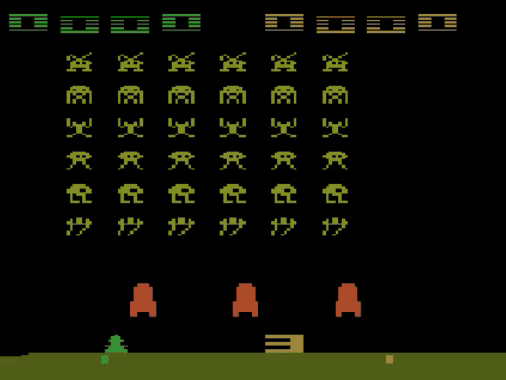

# Reinforcement Learning for Atari Games

This repository contains Python code for training an AI model to play Space Invaders and Super Mario Bros using Reinforcement Learning algorithms like Deep Q-Networks (DQN), Advantage Actor-Critic (A2C), and Proximal Policy Optimization (PPO) implemented with OpenAI's Gym library.

# Examples

## Space Invaders



## Super Mario Bros


## Requirements

You can install the dependencies using pip:

```bash
pip install -r requirements.txt
```
## Available Algorithms
- Deep Q-Networks
- Advantage Actor-Critic
- Proximal Policy Optimization
